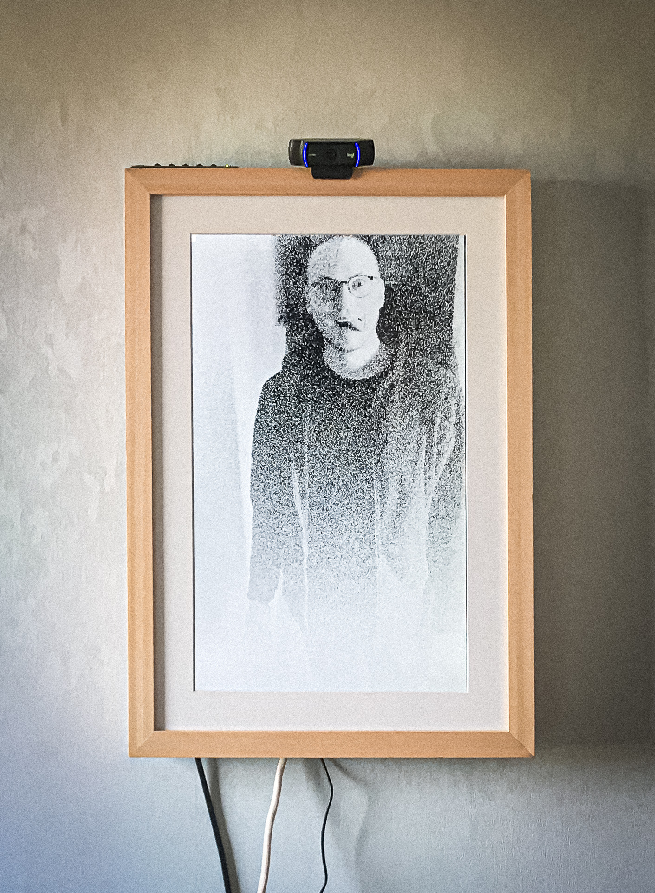

# Generative Portraits Booth

A photo application that utilizes facial tracking with *dlib* to turn webcam
video into generative art portraits. Built with [openframeworks](https://openframeworks.cc/).

## Controls

- `space` - Start countdown
- `return` - Switch to video preview mode
- `g` - Switch to gallery mode
